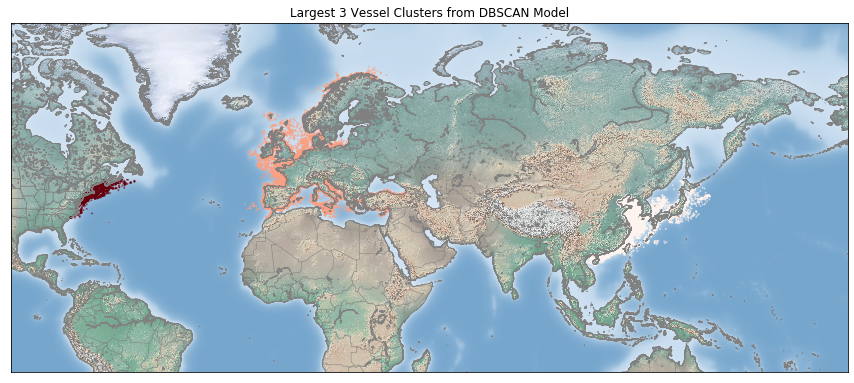

# From Dark to Transparent: Investigating Patterns in Global Fishing Activity

## Contents
- [Requirements](https://github.com/jessicarose00/Capstone/blob/master/requirements.txt)
- [Problem Statement](#Problem-Statement)
- [Executive Summary](#Executive-Summary)
    - [Data Acquisition](#Data-Acquisition)
    - [Exploratory Data Analysis and Modeling](#Exploratory-Data-Analysis-and-Modeling)
    - [Mapping and Visuals](#Mapping-and-Visuals)
- [Conclusions](#Conclusion)
- [Future Work](#Future-Work)
- [References](#References)

## Problem Statement
Illegal, unreported and unregulated (IUU) fishing poses a great threat to the sustainable management of fisheries and ocean biodiversity. Global fishing effort is poorly understood, suffering from a lack of transparency and weak enforcement. Fortunately, satellite technology and machine learning can revolutionize the way we monitor and understand global fishing activity.

One method for monitoring ocean activity worldwide involves tapping into vessel traffic data, also known as Automatic Identification System (AIS). Vessels equipped with AIS transponders automatically broadcast a signal of their location to nearby ships, orbiting satellites and land-based receivers (Malarky et al, 2018). This communication tool is primarily used to prevent collisions, but creates a valuable opportunity to increase public oversight of vessel activity.  

The challenge arises when there are gaps in AIS transmission. When this happens, a vessel can essentially 'go dark' and hinder real time location tracking. Gap events or the transmission of incorrect AIS information can occur for a variety of reasons, including:
- Low satellite coverage leading to poor quality transmissions
- High vessel density causing saturation of the system
- “If the master believes that the continual operation of AIS might compromise the safety or security of his/her ship, the AIS may be switched off. This might be the case in sea areas where pirates and armed robbers are known to operate.” (IMO, 2002)
- Desire to keep fishing grounds secret from competitors
- Intentional disabling of the AIS transmitter to hide illegal activity from regulators

This analysis is concerned with the situations where AIS signals are intentionally tampered with. The [Global Fishing Watch](https://globalfishingwatch.org/) (GFW) offered to share data on AIS gap events that took place between 2018 - 2019 and warrant deeper investigation. Drawing on this dataset, I conduct an exploratory analysis using unsupervised machine learning techniques to investigate trends and characteristics of vessels that are going dark.

## Executive Summary
The Global Fishing Watch's mission is to use satellite technology, cloud computing and machine learning to create a more complete and connected picture of global fishing activity. They have successfully developed [algorithms](https://globalfishingwatch.org/datasets-and-code/fishing-detection-models/) to detect fishing activity and intentional gap events, but are working to increase their understanding of these events. This project is a compliment to their work and draws on their [publicly available code](https://globalfishingwatch.org/datasets-and-code/) and the valuable insights shared on their [blog](https://globalfishingwatch.org/blog/). 

### Data Acquisition
[GFW's gap events dataset](#References) contains over 6 million observations of vessels 'going dark' for a period longer than 12 hours between AIS positions, from January 1, 2018 and December 31, 2019. The dataset was removed of any gaps events resulting from low satellite coverage or high vessel density. I used a random sample of 500,000 observations from the original dataset in this analysis. The data dictionary and code can be found in [this notebook](https://github.com/jessicarose00/Capstone/blob/master/code/01_Data_Acquisition_RawGapEvents.ipynb). 

Using each vessel's Maritime Mobile Service Identity (MMSI) number, I searched official public registries to learn more about the identity of the gap event vessels. This involved creating a [webscraping tool](https://github.com/jessicarose00/Capstone/blob/master/code/02_Data_Acquisition_Scraping.ipynb) to query the International Maritime Organization's (IMO) database and gather information on the vessel’s name, call sign, IMO number, and flag state. In the first step of this process, the algorithm queried approximately 80,000 MMSI numbers and classified them as either listed in the database or not. The second step required scraping the additional information on vessels that were listed. Unfortunately, the IMO website caps at a daily max of 100 search queries and I had a list of almost 10,000 MMSI numbers, so obtaining this information proved infeasible for the scope of this project. Nevertheless, vessels that are not listed in the IMO registry and with multiple gap event instances raise more suspicion. Knowing they are not listed on a vessel registry presents an opportunity ripe for investigation.

### Exploratory Data Analysis and Modeling
The exploratory analysis begins by broadly investigating patterns and relationships across gap events. I use unsupervised machine learning techniques like clustering to identify groups of vessels exhibiting similar behavior, specifically with regard to the duration and location of gap events. I select the model with the best silhouette score and focus the analysis on patterns within the three largest clusters to see if any broader insights can be gleaned about the vessels going dark in these areas. My exploration and conclusions can be reviewed in detail in this [notebook](https://github.com/jessicarose00/Capstone/blob/master/code/03_EDA.ipynb).

### Mapping and Visuals
In order to understand and identify patterns in the location of gap events, I overlay the results on maps. I used Matplotlib's [Basemap toolkit](https://matplotlib.org/basemap/) to visualize the activity of vessels in each cluster. The bubbles mark the location of the vessel's AIS off timestamp, or the moment it went dark. The color reflects the length of the gap event. The size of the bubble indicates the number of positions the vessel took on per day. GFW's [research](https://globalfishingwatch.org/data-blog/updated-fishing-lists-version-0-2/) shows that the number of positions a vessel assumes in a given year has implications for their activity. A vessel broadcasts its position via AIS every 2 to 10 seconds when moving, so vessels that are fishing typically have a higher number of positions. Please refer to [this notebook](https://github.com/jessicarose00/Capstone/blob/master/code/04_Visualization.ipynb) to see the referenced visualizations.

## Conclusion
Prior to clustering, it's clear that the dataset has a disproportionately high number of observations from China. Other highly represented countries include South Korea, Spain, Italy, Japan and Taiwan. As mentioned previously, vessels that appear multiple times in the dataset are important to note. For example, a single vessel from Great Britain appears 54 times, followed by one from China that appears 49 times and one from South Korea that appears 48 times. Since this data only represents a subset of randomly sampled MMSI numbers from a much larger dataset, these findings should be considered a starting point for deeper investigation.  

Investigating when vessels go dark throughout the year exposes some seasonality: a high number of vessels go dark between August - December, with smaller peaks from March - April and a significant drop in the early summer months. [GFW points out](https://globalfishingwatch.org/research/dynamics-global-fishing-fleet-interactive/) that if going dark is an indication of illegal activity, seasonal variation is better explained by political and cultural factors than natural oceanographic cycles. Recognizing the 3-month seasonality trends helped inform how to handle outliers. 22% of the dataset observations had AIS on and off timestamps at shore. If these observations also illustrated long gap hours, it's possible the vessel was at port with AIS turned off (Kroodsma et al, 2017). I decided to remove observations with on/off timestamps at shore and a gap hour length greater than 2,000 hours (3 months) since it would be challenging to infer much about behavior.

Turning to the results of the DBSCAN model, we see that clustering by coordinate and length of a gap event reveal groupings of data points near three different continents: Asia, Europe and North America.

A description of initial findings on each cluster is included in the conclusion section of the [EDA notebook](https://github.com/jessicarose00/Capstone/blob/master/code/03_EDA.ipynb). Consistent with the findings of the GFW, the analysis confirms that different gear types have different latitudinal distributions. In Cluster 0 (Asia), trawling is the most widespread activity and combined with set gillnets, comprises 50% of the activity seen in this cluster. This is quite large given the number of observations in this cluster. The average length of a gap event in Cluster 0 is much higher and there is significantly greater spread in the distribution of gap event durations when compared to Clusters 1 and 3. Prior to plotting the data on a map, I evaluated relationships between a vessel's location and the length of their gap event in each cluster. Overall, there didn't appear to be a correlation between these features except in Cluster 0, where we see shorter gap events ocurring off the eastern coast of Japan and longer gap events along the coasts of China, South Korea and Taiwan.  

Comparisons between the clusters are somewhat insightful, but each cluster's activity and characteristics have inherent links to their distinct geographic location. More valuable insights could be gained from a deep exploration of the traits within a cluster. Zooming in on the activity of specific vessels that commit several gap event offenses in this sample dataset might be a more worthwhile investigation.   

## Future Work

**Explore Validation Metrics:** Validation is one of the most challenging aspects of clustering (Moulavi et al, 2014). Clustering metrics are not designed to handle arbitrarily shaped clusters and therefore punish these irregularities when they might actually make sense.

**Revisit Vessel Registries:** The obstacles I encountered during the webscraping phase, hindered a two-tiered analysis that could have comparatively evaluated the behavior of the more "legitimate" registered vessels. Scraping the IMO database or another international fishing registry would add an interesting layer to this investigation.   

**Address Computational Limitations:** A primary limitation to this project was RAM, which made it difficult to experiment with the DBSCAN algorithm or conduct a more comprehensive evaluation of GFW's 2GB gap events dataset. Despite working with a smaller sample dataset (which presents its own challenges for definitive findings), I ran into continuous issues with memory. Computational resources would greatly enhance both the data acquisition and exploratory data analysis sections.  

**Add Data Layers:** The [Global Fishing Watch map](https://globalfishingwatch.org/our-map/) offers the option to overlay additional data with their vessel activity layers. Further investigation could involve overlaying data on Exclusive Economic Zones (EEZ) or Marine Protected Areas (MPA) to better understand if vessels are encroaching on prohibited areas.  

## References
- Global Fishing Watch, (personal communication)
- IMO (2002) Resolution A.917(22) Guidelines for the onboard operational use of shipborne automatic identification systems (AIS).  
- Malarky, Lacey and Beth Lowell (2018). "Avoiding Detection: Global Case Studies of Possible AIS Avoidance". Oceana.   
- Kroodsma, David A., et al. (2017) Tracking the global footprint of fisheries. Science 359.
- Moulavi, Davoud, et al. (2014) "Density-based clustering validation." Proceedings of the 2014 SIAM International Conference on Data Mining. Society for Industrial and Applied Mathematics.

